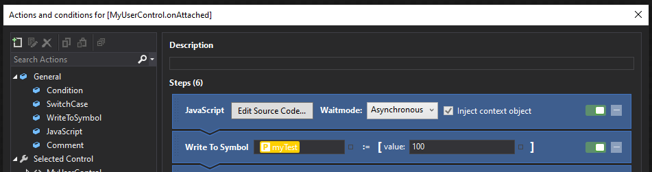

# exjs Documentation
>Extending what is possible with TcHmi

## Opening Statement
The code behind javascript file has been created to enhance the base functionality of TcHmi.  In time this will turn in to a Nuget package.  

## Getting started
Simply drag ex.js from the src directory in to a suitable folder in your TcHmi project.  I personally make a scripts folder for this. 

---
## TcHmi.System.Binding
The inner workins of Binding have been extended to support events. 

```javascript
Binding.exEvents
```

The following on change events are now possible. 
* stateInvalid
* stateInitializing
* stateResuming
* stateReady
* stateSuspended
* stateDestroyed

### Example

This example shows how to delay step execution in a usercontrol until after the binding has completed (stateReady). In this example myTest is the usercontrol parameter.  If you were to call this code without the javascript then the write to symbol would be missed as the binding would not be complete at this stage. 

```javascript
var self = TcHmi.Symbol.readEx('%ctrl%MyUserControl%/ctrl%');
var parent = self.getParent();
var binding = TcHmi.System.Services.bindingManager.getBinding('myTest', parent);

binding.exEvents.on('stateReady', ctx.success);
```


## EventEx

A new events class is available as EventEx.  This allows you to add callback events to your custom code.  

| Name | Comment | 
|-|-|
|on(eventName,callback)| Used to create a callback event |
|off(eventName,callback)| Used to remove a callback event |
|trigger(eventName,data)| Used to trigger a named callback event |

### Example
```javascript
class MyClass {

	constructor() {
		this.events = new ExEvent()
		this.__name = {};
	}

	Object.defineProperty(this, 'name', {
		get() {
			return this.__name;
		},

		set(value) {
			this.exEvents.trigger('nameChanged', value);
			this.__name; = value;
		}
	});

}

myObj = new MyClass();
myObj.events.on('nameChanged', function(newName){console.log(newName)});
myObj.name = 'foobar';

// foobar
```